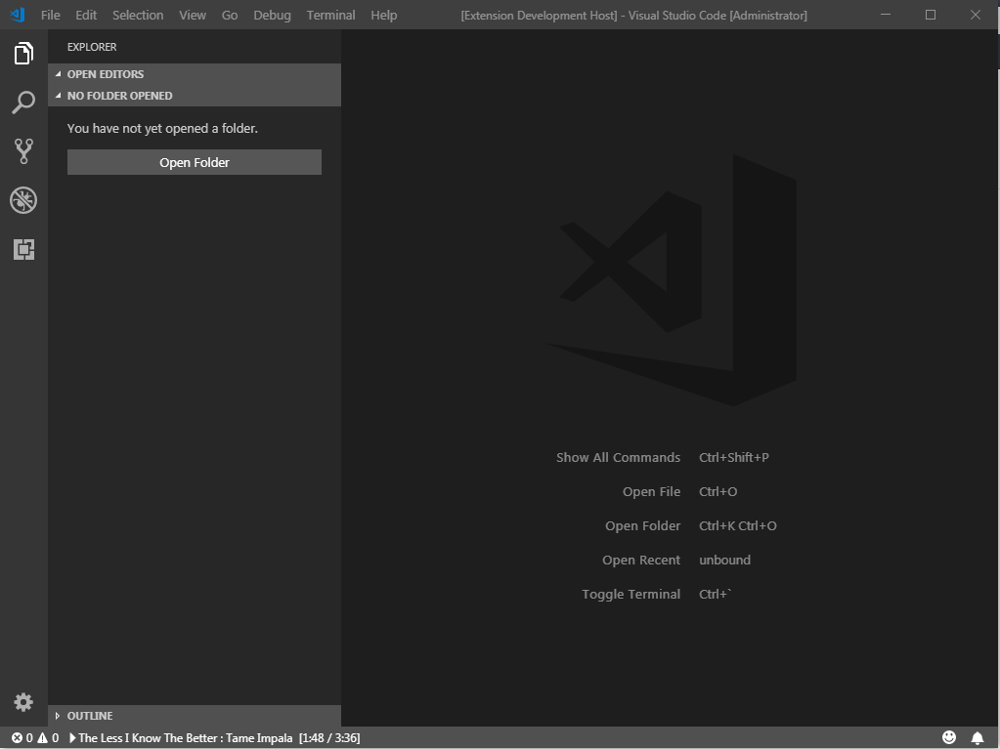

On backburner for now, feel free to submit some changes (more operating systems, music controls, etc)

# GPMDP - VSCode - Status bar
A small extension for VSCode that adds a status bar item for Google Play Music, it is required that the music be played through the [unofficial music player](https://github.com/leobeosab/GPMDP-VSCode-extension)

## Requirements
* Node
* Visual Studio: Code

## Todo
* Number formatting on time
* Code cleanup
* Cross platform
* Pause, Play, stop, shuffle, etc controls
* Connect to GPMDP without pin code

## Nice to haves
* read from Google Chrome version
* embed a GPM player in VSCode?

## Running
1. Clone repo
2. ```cd GPMDP-VSCode-extension```
3. ```code .```
4. Press Debug in VSCode

## Screenshot

